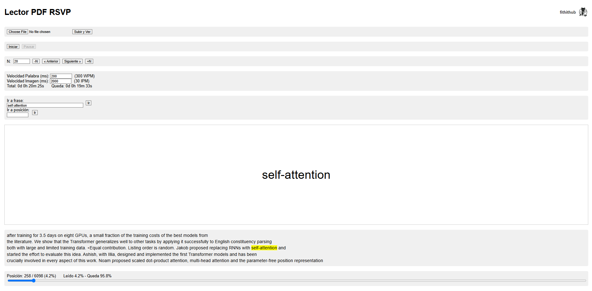
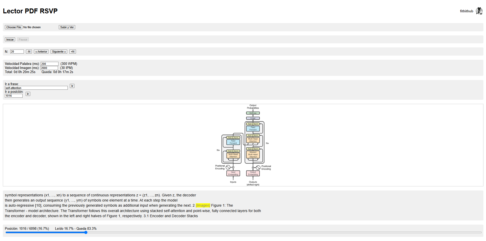

# 🚀 Lector PDF RSVP

**¿Y si pudieras ajustar tu velocidad de lectura igual que un vídeo de YouTube?**  
Con esta herramienta convertirás cualquier PDF en un flujo palabra por palabra usando la técnica RSVP (Rapid Serial Visual Presentation). Vuela por tus documentos a más de **1200 palabras por minuto** y disfruta de las imágenes incrustadas, perfectamente sincronizadas con tu ritmo de lectura.



---

## 📂 Estructura del proyecto

```
.
├── app.py                # Servidor Flask principal
├── requirements.txt      # Dependencias Python
├── uploads/              # PDFs subidos por el usuario
├── static/
│   ├── images/           # Imágenes extraídas y redimensionadas
│   └── logos/            # Logo de fithithub
└── README.md             # Este archivo
```

---

## ⚙️ Instalación

1. **Clona el repositorio**  
   ```bash
   git clone https://github.com/fithithub/lector_rapido.git
   cd lector_rapido
   ```

2. **Crea y activa un entorno virtual**  
   ```bash
   python3 -m venv venv
   source venv/bin/activate
   ```

3. **Instala dependencias**  
   ```bash
   pip install -r requirements.txt
   ```

4. **Ejecuta la aplicación desde el Jupyter notebook**  
   Abre la dirección que aparece en los outputs (por ejemplo, http://127.0.0.1:5000).

---

## 🚀 Uso

1. Abre tu navegador en el puerto indicado por la celda de Jupyter o `http://localhost:5000`.
2. Sube un PDF (arrastrando o seleccionándolo) y haz click sobre "Subir y ver".
3. Haz clic en **Start** para comenzar la presentación palabra por palabra.
4. Ajusta la **velocidad de palabras (ms)** y la **velocidad de imágenes (ms)** según tu preferencia.
5. Puedes pausar la presentación y navegar con:
   - **Next » / « Previous**  
   - **±N** para saltos rápido.
   - **Buscar frase** o **Ir a posición**.

---

## 🎯 Funcionlidades clave

- 🔥 Velocidad ajustable de **palabras** (PPM) e **imágenes** (IPM).  
- 📊 Seguimiento de progreso: tiempo total, restante y porcentaje leído.  
- 🔄 Navegación por frase o posición.  
- 🖼️ Soporte completo de **imágenes** incrustadas.  
- ✅ Interfaz web minimalista con controles de reproducción y búsqueda.



---

## 💡 Ideas para mejorar

- 📷 OCR para PDFs escaneados o basados en imágenes.  
- 📑 Gestión avanzada de tablas y contenido estructurado.  
- 🌐 Traducción en tiempo real antes de mostrar.  
- 🔊 Integración de TTS para lectura en voz alta.  
- 📱 Versión móvil o empaquetada.
  
---

## 📄 Licencia

Este proyecto está licenciado bajo la licencia MIT — ver el archivo [LICENSE](LICENSE) para más detalles.
